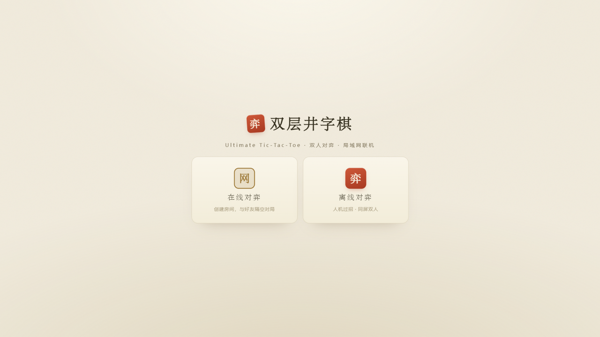
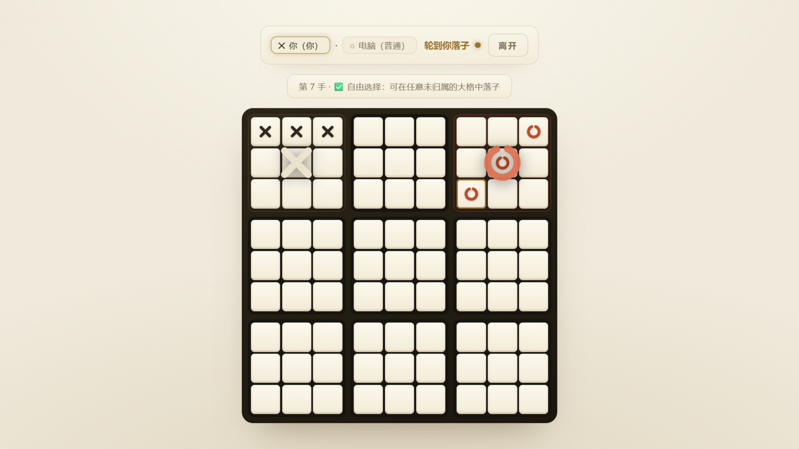
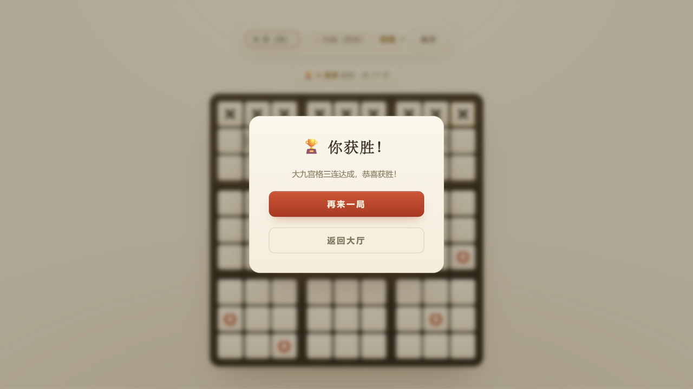
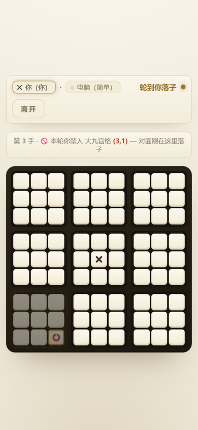

<div align="center">

# ⛋ 双层井字棋

**Ultimate Tic-Tac-Toe · 双人对弈 / 人机对弈 / 局域网联机**

[](README.md#-快速开始)
[]()
[]()
[](#-许可)

一款**双层九宫格**策略棋：3×3 大格 × 3×3 小格，共 **81 个落子位**。
两人打开同一个网页、输入 **4 位房间码**即可 P2P 直连对弈，也可以随时与三档难度的电脑过招。

**「落子定禁区」**——你下在哪，对面就进不去哪。

</div>

---

<table>
  <tr>
    <td align="center"></td>
    <td align="center"></td>
    <td align="center"></td>
    <td align="center"></td>
  </tr>
  <tr>
    <td align="center"><sub>大厅入口</sub></td>
    <td align="center"><sub>离线对弈</sub></td>
    <td align="center"><sub>对局中</sub></td>
    <td align="center"><sub>终局</sub></td>
  </tr>
</table>

## ✨ 特性一览

- 🌐 **局域网联机** — WebRTC P2P 直连，4 位房间码即开即玩，无需服务器
- 🤖 **人机对弈** — 简单 / 普通 / 困难三档 AI，困难档为双层搜索
- 👥 **双人单机** — 同屏轮流执子，一部设备就能开战，重开自动轮换先手
- 📊 **战绩与对局记录** — 底部悬浮岛导航切换「大厅 / 对局记录 / 我的」，战绩、胜率与近 50 局记录本地保存
- 🎨 **墨 × 朱 视觉** — 宣纸棋格、SVG 笔触棋子、落子弹入动画、禁入斜纹、鎏金胜局脉冲
- 📱 **安卓应用** — WebView 封装 APK，AI 模式完全离线可玩
- 🪶 **零依赖单文件** — 网页版只有一份 `index.html`，无需安装、无需构建
- 📐 **竖屏横屏都好玩** — 移动端自适应布局，触控优化

## 🎮 游戏规则

### 棋盘结构

```
┌─────────────┬─────────────┬─────────────┐
│ ┌───┬───┬───┐ │ ┌───┬───┬───┐ │ ┌───┬───┬───┐ │
│ │   │   │   │ │ │   │   │   │ │ │   │   │   │ │
│ ├───┼───┼───┤ │ ├───┼───┼───┤ │ ├───┼───┼───┤ │
│ │   │   │   │ │ │   │   │   │ │ │   │   │   │ │
│ ├───┼───┼───┤ │ ├───┼───┼───┤ │ ├───┼───┼───┤ │
│ │   │   │   │ │ │   │   │   │ │ │   │   │   │ │
│ └───┴───┴───┘ │ └───┴───┴───┘ │ └───┴───┴───┘ │
├─────────────┼─────────────┼─────────────┤
│      ...    │     ...     │     ...     │
├─────────────┼─────────────┼─────────────┤
│      ...    │     ...     │     ...     │
└─────────────┴─────────────┴─────────────┘
```

外层粗线 = 大九宫格（3×3），每个大格内部 = 小九宫格（3×3）

### 核心规则：禁入机制

> **"落子定禁区"** — 反向终极井字棋

- 玩家 A 在某个**大格**内落子后，遮罩立即盖在该大格上
- 玩家 B 下一轮**禁止进入该大格**（其内全部 9 个小格不可落子）——遮罩始终跟随上一手落子所在的大格
- 若该大格已归属某玩家或已满（平局），禁入限制**自动解除**，可自由选择

**示例：**
> 你在大格 4（中心）落子 → 对方下一轮不可再进入大格 4

### 胜负判定

| 层级 | 条件 | 结果 |
|:-----|:-----|:-----|
| **小格胜负** | 小九宫格内三连（横/竖/斜） | 该大格归属对应玩家 |
| **终局胜负** | 大九宫格整体三连（横/竖/斜） | 该玩家获得本局胜利 |
| **平局** | 可落子区域耗尽且无大格三连 | 本局平局 |

> 🔄 **重开轮换先手**：点击「再来一局」后，先手方在 ✕/○ 之间轮换，保证双方公平。

## 🚀 快速开始

### 方式一：直接打开（推荐）

1. 双方各自用浏览器打开 `index.html`，在大厅选择**「在线对弈」**
2. 玩家一：输入昵称 → 点击 **「创建房间」** → 获得 4 位房间码
3. 玩家二：输入昵称和房间码 → 点击 **「加入房间」**
4. 连接建立，开始对弈！

### 方式二：局域网服务器

```bash
npx serve .
# 或
python -m http.server 8080
```

然后用局域网 IP 访问（如 `http://192.168.1.100:8080`）

### 方式三：离线对弈

在大厅选择**「离线对弈」**，两种玩法：

- **人机对弈**：选择难度（简单 / 普通 / 困难）单机开局。你执墨 ✕ 先手，电脑执朱 ○

  | 难度 | 思路 | 适合 |
  |:-----|:-----|:-----|
  | **简单** | 能一手取胜就取胜，否则随机落子 | 熟悉规则 |
  | **普通** | 启发式评估 + 规避「送给对面致胜机会」 | 休闲对弈 |
  | **困难** | 双层搜索，按对面最强回应取最优 | 想被虐一下 |

- **双人单机**：与好友同屏轮流执子，一部设备就能开战；重开自动轮换先手

### 方式四：安卓安装包

`android/dist/双层井字棋-v1.0.apk` 是打包好的安卓应用（WebView 壳 + 内嵌游戏）：

1. 把 APK 传到手机（微信/数据线/局域网均可），点击安装，允许「安装未知来源应用」
2. 桌面出现「双层井字棋」图标，打开即玩
3. **人机对弈完全离线可玩**（PeerJS 已内联进安装包）；**LAN 联机**的首次握手需联网（PeerJS 云信令），建立连接后为 P2P 直连
4. 系统要求 Android 5.0（API 21）及以上

<table>
  <tr>
    <td align="center"></td>
  </tr>
  <tr>
    <td align="center"><sub>手机竖屏 · 禁入提示一目了然</sub></td>
  </tr>
</table>

## 🛠 技术架构

| 模块 | 技术方案 |
|:-----|:---------|
| **网络通信** | WebRTC (PeerJS) — P2P 直连 |
| **信令服务** | PeerJS Cloud Server（仅握手阶段） |
| **游戏逻辑** | 纯 JavaScript 状态机 |
| **电脑 AI** | 评估函数 + 双层搜索（简单=随机，普通=启发式评估，困难=两层搜索） |
| **安卓封装** | WebView 单 Activity 壳，javac→d8→aapt2→zipalign→apksigner 手工构建，见 `android/build.sh` |
| **界面渲染** | 原生 DOM + CSS3 动画 |
| **部署方式** | 单 HTML 文件，零依赖安装 |

### 通信协议

```
Host (✕)                         Guest (○)
     │                                │
     │──── create room ────────────→  │
     │←─── join room + connect ────  │
     │                                │
     │←─── hello (交换昵称) ────────→ │
     │                                │
     │──── game_state (全量同步) ──→  │
     │                                │
     │  [Host 落子：本地更新 + 同步]   │
     │──── game_state ─────────────→  │
     │                                │
     │              [Guest 落子]       │
     │←─── move (li, si) ──────────  │
     │  [Host 处理后必回包同步]        │
     │──── game_state ─────────────→  │
     │                                │
     │          [Guest 请求重开]       │
     │←─── restart_request ────────  │
     │──── game_state (新局) ──────→  │
```

## 📁 项目结构

```
双层井字棋LAN联机对弈/
├── index.html      # 完整游戏（HTML+CSS+JS 一体化）
├── android/        # 安卓壳工程（清单/Activity/图标/离线资产/构建脚本）
│   └── dist/       # 签名好的 APK 产物
├── docs/
│   └── screenshots # README 展示图
└── README.md       # 项目说明文档
```

## 🌐 浏览器兼容性

| 浏览器 | 支持情况 |
|:-------|:---------|
| Chrome 80+ | ✅ 完全支持 |
| Edge 80+ | ✅ 完全支持 |
| Firefox 75+ | ✅ 完全支持 |
| Safari 14+ | ✅ 完全支持 |
| 移动端浏览器 | ✅ 响应式适配 |

## ⚠️ 已知限制 & 注意事项

1. **首轮握手需要互联网**：PeerJS 信令服务器用于建立初始连接，连接建立后转为纯 P2P 局域网通信
2. **NAT 穿透**：同局域网内基本无障碍；跨 NAT 可能需要 STUN/TURN 服务器
3. **房间码唯一性**：相同房间码同时只能有一组对局

## 📝 开发记录

<details open>
<summary><b>迭代 9 · 底部悬浮岛导航（战绩 / 记录 / 我的）</b>（最新）</summary>

- 新增 iOS 灵动岛式**底部悬浮导航**，三个页签：**大厅** / **对局记录** / **我的**；对局进行中自动隐藏，保证沉浸
- **对局记录页**：胜 / 负 / 和 / 胜率总览 + 最近 50 局记录（时间、模式、对手、手数、结果），支持清空
- **我的页**：棋手档案 + 总战绩 + 各模式战绩明细（在线 / 人机按胜负统计，双人单机计局数）
- 记录按视角统计：联机与人机按「你」的视角计胜负，双人单机只进记录不计个人胜负
- 数据经 localStorage 持久化（安卓 WebView 已启用 DOM Storage，APK 内同样生效）
- 手机竖屏原生适配：悬浮导航贴底含 safe-area 安全区，页面满宽自适应、无横向溢出

</details>

<details>
<summary><b>迭代 8 · 双入口导航 + 双人单机</b></summary>

- 大厅重构为两级导航：主入口两张卡片「在线对弈 / 离线对弈」，二级页分别承载创建/加入房间与人机、双人单机，均可一键返回大厅
- 新增**双人单机**模式：同屏轮流执子，状态栏轮流高亮执子方（轮到 ✕ 先手 / ○ 后手），重开自动轮换先手，终局按「玩家一 / 玩家二」判定
- 禁入提示按模式区分文案：联机/人机显示「你被禁 / 对面被禁」，双人单机显示中性「本轮禁入 — 上一手落子于此」
- 安卓资产同步重建，APK 与网页版保持一致

</details>

<details>
<summary><b>迭代 7 · 安卓版本</b></summary>

- 新增 `android/` WebView 壳工程：单 Activity 全屏加载内嵌游戏，横竖屏切换不重载（`configChanges`），AI 模式完全离线可玩
- 安卓资产内联 PeerJS（1.5.2），APK 不依赖 CDN；LAN 联机的首次握手仍需联网
- 构建链：`javac → d8 → aapt2 → zipalign → apksigner`，一条 `bash android/build.sh` 产出签名 APK（debug.keystore 随仓库分发，重复构建签名一致、可覆盖安装）
- 产物：`android/dist/双层井字棋-v1.0.apk`（minSdk 21 / targetSdk 29，Android 5.0+）

</details>

<details>
<summary><b>迭代 6 · 禁入规则修正</b></summary>

- 规则变更：禁入目标从「小格位置 (r,c) 坐标映射的大格」改为「**上一手落子所在的大格**」——即"你下在哪个大格，对面下一轮就禁入哪个大格"，遮罩始终跟随对面的落子，不再落到自己地盘上
- 信息条按视角明确标注禁入对象：轮到你时显示「本轮你禁入」，对面思考时显示「对面禁入」
- 引擎行为经全套单测回归：原 17 手确定性胜局在新规则下依然成立，3000 局随机对局不变量、AI 三档自对弈与难度梯度全部通过

</details>

<details>
<summary><b>迭代 5 · 浅色主题</b></summary>

- 全套配色翻转为浅色「宣纸」主题：宣纸底 + 墨色文字，深木框棋盘成为画面视觉中心；朱红印章、朱砂 ○、鎏金点缀保留
- `theme-color` 同步为纸色；面板/输入框/按钮/遮罩/Toast 全部换为浅色系与暖色阴影
- 禁入斜纹、最后一手金环、胜局脉冲等对局内视觉在浅色背景下重新校准对比度

</details>

<details>
<summary><b>迭代 4 · 人机对弈模式</b></summary>

- 引擎重构：抽出 `cloneState` / `validMovesFor` / `applyMoveTo` 纯函数，`makeMove` 委托执行，为 AI 搜索铺路（行为不变，3000 局随机对局回归通过）
- 三档难度 AI：简单（随机）/ 普通（启发式评估 + 规避致胜威胁）/ 困难（双层搜索）
- 大厅新增「人机对弈」卡片与难度胶囊按钮；状态栏展示「你 ✕ / 电脑 ○（难度）」并隐藏房间码
- 交互细节：AI 思考期间显示「电脑思考中…」并锁定点击；终局遮罩区分「你获胜 / 电脑获胜」

</details>

<details>
<summary><b>迭代 3 · 视觉重设计 + 竖屏适配</b></summary>

- 「墨 × 朱」主题：弃用蓝紫霓虹暗色，改为暖墨背景 + 宣纸棋格 + 木色棋盘框
- SVG 棋子：✕/○ 改为内联 SVG（圆头笔触，○ 带留白缺口的手绘感），大格归属用同源大号棋子水印
- 细节动效：落子弹入动画、胜局连线鎏金脉冲、禁入区红色斜纹 hatch、hover 效果隔离在 `@media(hover:hover)` 内
- 竖屏/小屏适配：棋盘尺寸由 `min(92vw, 100dvh - 215px)` 驱动，`touch-action:manipulation` 消除双击缩放延迟

</details>

<details>
<summary><b>迭代 2 · 联机健壮性 + 信息增强</b></summary>

- 昵称握手：连接建立后通过 `hello` 消息交换昵称，状态栏展示双方昵称与回合归属
- 最后一手高亮：最近落子格显示金色描边，随 `game_state` 同步到两端
- 重开轮换先手：再来一局时 ✕/○ 交替先手，重开请求由主机权威处理
- 断连遮罩修复：主动返回大厅不再误弹「对方断开连接」
- Guest 卡死修复：落子 4 秒无响应自动重新同步；主机对无效落子也回包
- 房间码冲突：主机检测到房间码被占用自动换码重试；加入不存在的房间即时提示
- 信息条增强：显示手数

</details>

<details>
<summary><b>迭代 1 · 初版</b></summary>

- 棋盘渲染：CSS Grid 双层布局，大格/小格边界区分明显
- 禁入可视化：禁入大格显示暗红色调 + 降低透明度
- 胜局高亮：获胜大格连线脉冲动画
- 竞态防护：`moveInProgress` 标志位防止快速双击

</details>

## 📄 许可

MIT License — 自由使用、修改和分发
